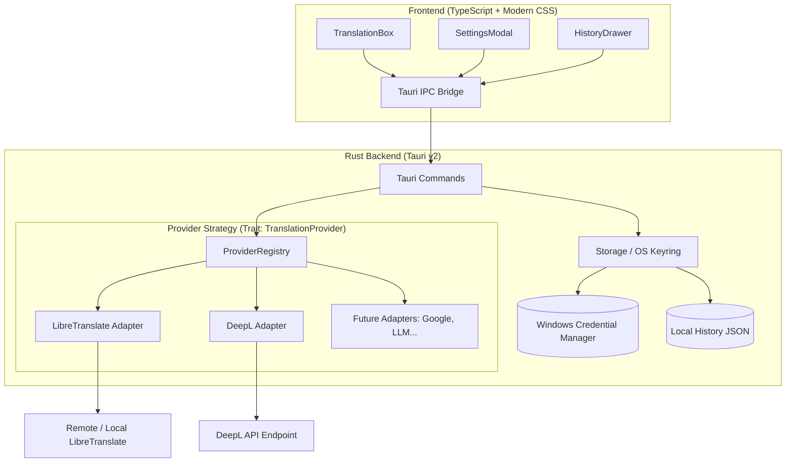

# 🌐 LibreLingo

<div align="center">

[](https://github.com/iiamdark/LibreLingo/actions/workflows/ci.yml)
[](https://github.com/iiamdark/LibreLingo/releases)
[](LICENSE)
[](https://www.rust-lang.org/)
[](https://v2.tauri.app/)
[]()

**A modern, lightweight, privacy-conscious open-source desktop translator built with Rust & Tauri v2.**

[Download Latest Release](https://github.com/iiamdark/LibreLingo/releases) &bull;
[Features](#-key-features) &bull;
[Architecture](#-architecture) &bull;
[Development](#-getting-started-locally) &bull;
[Contributing](CONTRIBUTING.md) &bull;
[Roadmap](#-future-roadmap)

</div>

---

## 📖 Overview

**LibreLingo** is an extensible desktop translation tool designed for developers, translators, and privacy enthusiasts. Unlike monolithic web wrappers that consume hundreds of megabytes of RAM, LibreLingo is powered by **Rust** and **Tauri v2**, giving it a tiny memory footprint (~30 MB RAM) and instant startup times while utilizing Windows' native WebView2 runtime.

LibreLingo implements a modular **Strategy / Adapter architecture**, allowing you to seamlessly choose and switch between different translation engines — from 100% open-source self-hosted instances (**LibreTranslate**) to neural engines (**DeepL**) — with all API keys safely stored inside your operating system's native cryptographic vault.

---

## ✨ Key Features

- 🚀 **Blazing Fast & Ultra-Lightweight**: Built with Rust; small binary size (~10 MB) and minimal memory usage.
- 🔌 **Pluggable Multi-Provider Architecture**:
  - **LibreTranslate (Default)**: 100% open-source machine translation. Works out of the box using free public servers, or connect to your own private Docker instance (`http://localhost:5000`).
  - **DeepL API**: Connect your free (`:fx`) or Pro DeepL API key for state-of-the-art neural translations.
  - Easily extensible for Google Translate, Microsoft Translator, AWS, and local AI/LLMs.
- 🔐 **Military-Grade Key Security**: API keys are **never** stored in plain text configuration files. They are encrypted and managed directly by the **Windows Credential Manager** (or macOS Keychain / Linux Secret Service) using native OS keyrings.
- 🎨 **Modern Fluent GUI**:
  - Adaptive Dark and Light themes with automatic system preference detection.
  - Automatic language detection with confidence scoring.
  - One-click language swap (`<->`).
  - Character counters, clear button, and one-click clipboard copy with visual feedback.
  - Keyboard shortcuts (`Ctrl + Enter` to translate instantly, `Esc` to dismiss modals).
- 📜 **Offline Translation History**: Local history drawer to view, reload, or copy previous translations without sending data to external tracking services.

---

## 🏛️ Architecture

LibreLingo is structured cleanly into two decoupled layers:



### Why Rust + Tauri v2?
1. **Distribution Size**: Electron installers typically weigh 80MB-120MB and unpack to >250MB. LibreLingo compiles down to ~10MB.
2. **Resource Efficiency**: Idle memory consumption is ~30MB versus >200MB in Chromium-based wrappers.
3. **Typography & Script Rendering**: Language translation apps require flawless Unicode rendering for non-Latin scripts (CJK, Arabic, Devanagari, Cyrillic) and native IME input. WebView2 handles this out of the box.
4. **Native Security**: Using Rust's `keyring-rs` crate allows seamless integration with the OS credential store without complex C++ node addons.

---

## 📁 Repository Structure

```
LibreLingo/
├── .github/
│   └── workflows/
│       ├── ci.yml                 # Automated test & build verification on Windows/Linux/macOS
│       └── release.yml            # Multi-platform installer & binary publisher
├── src-tauri/                     # Rust backend
│   ├── Cargo.toml                 # Rust dependencies & metadata
│   ├── tauri.conf.json            # Tauri v2 window and security configuration
│   ├── build.rs                   # Tauri build script
│   ├── capabilities/              # Tauri v2 security capabilities
│   ├── icons/                     # Application icons (.ico, .png)
│   └── src/
│       ├── main.rs                # Native binary entrypoint
│       ├── lib.rs                 # Tauri setup & command registration
│       ├── error.rs               # Strongly typed AppError definitions
│       ├── models/                # Data transfer objects (DTOs)
│       │   ├── request.rs         # TranslationRequest, ProviderConfigPayload
│       │   ├── response.rs        # TranslationResponse, LanguageInfo, ProviderMetadata
│       │   └── history.rs         # HistoryItem
│       ├── providers/             # Strategy / Adapter pattern
│       │   ├── mod.rs             # TranslationProvider trait & ProviderRegistry
│       │   ├── libretranslate.rs  # LibreTranslate implementation
│       │   └── deepl.rs           # DeepL Free/Pro implementation
│       ├── storage/               # Persistence & Security
│       │   ├── keyring.rs         # Windows Credential Manager integration
│       │   └── history_store.rs   # Local history & config store
│       └── commands/              # Tauri IPC commands
│           ├── translate.rs       # translate_text, detect_language
│           ├── settings.rs        # get_providers, save_provider_config
│           └── history.rs         # get_history, clear_history
├── src/                           # Frontend UI (TypeScript + Vite)
│   ├── index.html                 # Main HTML shell
│   ├── package.json               # Node dependencies
│   ├── tsconfig.json              # TypeScript strict configuration
│   ├── vite.config.ts             # Vite bundler configuration
│   └── src/
│       ├── main.ts                # App state controller
│       ├── styles/
│       │   └── app.css            # Dark/Light CSS design system
│       ├── components/            # UI Components
│       │   ├── Header.ts          # Brand, theme switch, settings trigger
│       │   ├── TranslationBox.ts  # Dual-pane textareas & language controls
│       │   ├── SettingsModal.ts   # Provider & API key configuration
│       │   └── HistoryDrawer.ts   # Translation history panel
│       └── services/
│           └── tauri-api.ts       # Type-safe IPC invoke wrappers with browser dev mock
├── .gitignore
├── LICENSE                        # MIT License
├── CONTRIBUTING.md                # Guide for contributors (adding new providers)
└── README.md                      # Project documentation
```

---

## 🚀 Getting Started Locally

### Prerequisites

1. **Node.js**: Version 18 or 20+ installed.
2. **Rust**: Installed via `rustup` ([rustup.rs](https://rustup.rs/)).
   ```powershell
   # On Windows via winget:
   winget install Rustlang.Rustup
   ```
3. **C++ Build Tools**:
   - On Windows: Visual Studio C++ Build Tools (with "Desktop development with C++").

### Clone and Install

```bash
git clone https://github.com/iiamdark/LibreLingo.git
cd librelingo
npm install
```

### Run in Development Mode

```bash
# Launches the Tauri desktop application with Hot Module Replacement (HMR)
npm run tauri dev
```

> **Tip for Frontend Work**: If you want to tweak UI styles or components without compiling the Rust backend, run `npm run dev` to launch the preview directly in your browser with built-in mock responses!

### Build Production Executable

```bash
npm run tauri build
```

This will produce the standalone `.exe` and NSIS setup installer in `src-tauri/target/release/bundle/nsis/`.

---

## ⚙️ Configuring Translation Providers

Open the **Settings** modal in the top right corner of the app:

### 1. LibreTranslate (Free & Open Source)
- **Default Server**: `https://translate.argosopentech.com` (public mirror, no API key required).
- **Self-Hosted Instance**: You can run your own local instance via Docker:
  ```bash
  docker run -ti --rm -p 5000:5000 libretranslate/libretranslate
  ```
  Then enter `http://localhost:5000` in LibreLingo's server URL field.
- **API Key**: Optional, unless using a managed or commercial LibreTranslate host.

### 2. DeepL
- Sign up for a free developer account at [deepl.com](https://www.deepl.com/pro-api).
- Free account keys typically end with `:fx` (e.g. `12345678-abcd-1234-abcd-1234567890ab:fx`).
- Enter your key in Settings and click **Save Changes**. Your key is immediately stored in the Windows Credential Manager.

---

## 🗺️ Future Roadmap

- [ ] **Cross-Platform Packaging**: Automated Linux `.deb`/`.AppImage` and macOS `.dmg` builds.
- [ ] **Global Hotkey Pop-up**: Raycast / Alfred-style quick pop-up window (`Alt + Space` or `Win + Shift + T`) to translate highlighted text anywhere in the OS.
- [ ] **Document & File Translation**: Drag & drop support for `.txt`, `.docx`, `.pdf`, and `.srt` subtitle files.
- [ ] **Speech-to-Text & Audio Translation**: Voice input via Whisper or native OS speech synthesis (TTS) to read translations aloud.
- [ ] **Offline Local LLMs**: Direct integration with local AI runtimes (e.g., Ollama or ONNX Runtime) to translate completely offline with zero internet access.
- [ ] **Additional Cloud Providers**: Google Cloud Translation API, Microsoft Azure Translator, and Amazon Translate adapters.

---

## 🤝 Contributing

Contributions are warmly welcome! Whether you are implementing a new translation provider, enhancing accessibility, or refining styling, please read [CONTRIBUTING.md](CONTRIBUTING.md) to get started.

---

## 📄 License

This project is licensed under the **MIT License** — see the [LICENSE](LICENSE) file for details.

